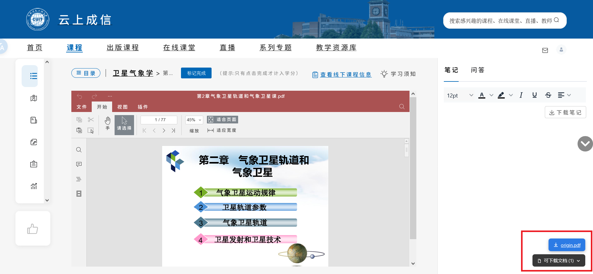
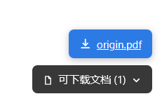

# 云上成信文档下载助手

一个用于云上成信平台（kczx.cuit.edu.cn）的用户脚本。自动识别课程中用 ONLYOFFICE 渲染的 PDF / Word / PPT / Excel 等文件，在页面右下角提供下载入口。

## 预览

## 安装

1. 安装用户脚本管理器：Tampermonkey（Chrome / Edge / Firefox）、Violentmonkey（Firefox）或 Userscripts（Safari）。
2. 打开安装链接：[GitHub](https://raw.githubusercontent.com/OpenCUIT/kczxDownloader/main/main.js) | [Greasy Fork](https://greasyfork.org/zh-CN/scripts/596806-%E4%BA%91%E4%B8%8A%E6%88%90%E4%BF%A1%E6%96%87%E6%A1%A3%E4%B8%8B%E8%BD%BD%E5%8A%A9%E6%89%8B)
3. 打开任意云上成信课程页面，脚本自动生效。

## 使用

1. 登录云上成信平台，进入课程，打开需要下载的课件。
2. 文档加载完成后，右下角出现「可下载文档 (N)」胶囊按钮。
3. 点击展开，列表出现在按钮上方；点击条目在新标签页打开文件，保存即可。
4. 再次点击胶囊按钮收起列表。

## 特性

- 自动识别 ONLYOFFICE 缓存中的办公文档，支持 PDF、DOC/DOCX、PPT/PPTX、XLS/XLSX、XLSM、PPTM、DOTX、ODT/ODS/ODP、TXT、RTF 等。
- 折叠式界面，默认不打扰；展开后按钮位置固定，列表向上生长。
- 路由切换自动清空列表，不残留上一页内容。
- 网络拦截与 DOM 扫描均做了批量合并与空闲调度，不影响页面加载与编辑器初始化。
- 兼容 WebVPN 代理访问。
- 不请求外部服务，不写入 localStorage，数据仅存于当前会话内存。

## 注意事项

- 必须处于登录状态，脚本打开的是带签名的 ONLYOFFICE 缓存链接，无 Cookie 时会 403 或 404。
- 缓存链接带过期时间，过期后重新打开课件即可生成新链接。
- 列表条目名取自 URL 末段，可能与课件真实名称不一致（缓存层常为 origin.pdf，此时显示为「文档」），不影响下载。
- 脚本只在云上成信平台（kczx.cuit.edu.cn）下运行，不向任何第三方发送数据。
- 仅供个人学习使用，请勿用于批量爬取或传播受版权保护的课程资料。

## 反馈

遇到问题请到 Issues 反馈，并附上浏览器版本、脚本管理器版本以及控制台中 [KCZX] 前缀的日志。

## 赞赏

## 许可证

MIT License © Pfolg
